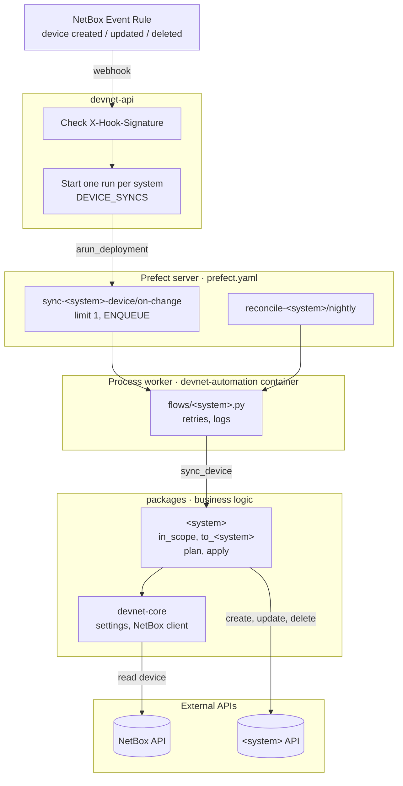

# Architecture

How a change in NetBox reaches the systems devnet keeps in sync with it.

## Components

```mermaid
---
config:
  flowchart:
    wrappingWidth: 320
---
flowchart TB
    rule["NetBox Event Rule<br/>device created / updated / deleted"]

    subgraph api["devnet-api"]
        verify["Check X-Hook-Signature"]
        dispatch["Start one run per system<br/>DEVICE_SYNCS"]
    end

    subgraph prefect["Prefect server · prefect.yaml"]
        deploy_change["sync-#lt;system#gt;-device/on-change<br/>limit 1, ENQUEUE"]
        deploy_nightly["reconcile-#lt;system#gt;/nightly"]
    end

    subgraph worker["Process worker · devnet-automation container"]
        system_flow["flows/#lt;system#gt;.py<br/>retries, logs"]
    end

    subgraph packages["packages · business logic"]
        system_pkg["#lt;system#gt;<br/>in_scope, to_#lt;system#gt;<br/>plan, apply"]
        core["devnet-core<br/>settings, NetBox client"]
    end

    subgraph external["External APIs"]
        nb_api[("NetBox API")]
        system_api[("#lt;system#gt; API")]
    end

    rule -->|webhook| verify
    verify --> dispatch
    dispatch -->|arun_deployment| deploy_change
    deploy_change --> system_flow
    deploy_nightly --> system_flow
    system_flow -->|sync_device| system_pkg
    system_pkg --> core
    core -->|read device| nb_api
    system_pkg -->|create, update, delete| system_api
```
